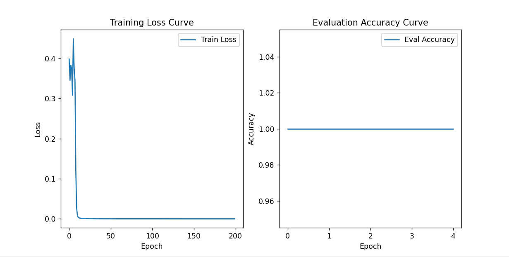

# code.py
- 实现了一个包含8个智能体（agents）的 **分布式倒立摆系统**，其中节点4是 **拜占庭节点**（故障节点），会发送恶意信号干扰系统。我们采用 **RCP-f 过滤器** 和 **鲁棒控制策略** 使系统仍然能够稳定跟踪参考轨迹。
- 拜占庭攻击模式 
   - 选定某个智能体（`faulty_agent=4`），使其状态估计 `v_hat` 发送**恶意信号**：
    ```
    v_faulty_1 = 50 * sin(10t) + 15 * cos(12t)
    v_faulty_2 = t / 15
    ```

- **RCP-f 过滤器（Resilient Consensus Protocol）**：
  - 过滤掉 **最不可信** 的 `f` 个邻居数据，以减少拜占庭节点的影响。

- **鲁棒控制**：
  - 计算 **最优控制律** `u` 使得智能体能够稳定倒立摆，并跟踪参考信号：
    ```
    u = K11 * x + K12 * v_hat
    ```
  - 通过 **Sylvester 方程** 和 **Riccati 方程** 求解控制增益 `K11` 和 `K12`。
- 代理节点的状态方程为 
  ```
  dv_hat = S @ v_hat + 10 * (v_real - v_hat) + 1 * filtered_v`
  ```
- 非代理节点的状态方程为 
   ```
   dv_hat = S @ v_hat + 10 * (filtered_v - v_hat)
   ```
- 结果分析：


# debug.py
1. 对系统的输入信号误差可视化，测试时间为10秒


# LLM.py
1. 基于 BERT 模型对分布式系统中的节点状态进行文本分类，以检测拜占庭故障节点。仿真数据来自系统代码中的 sol 变量。
2. `format_signal` ：将系统状态转换为文本描述，接受 某个智能体（agent）编号 agent_id 和 某个时间步长 t_index，然后获取该智能体在该时刻的状态信息，并将其转换为字符串格式的文本描述。
3. 学习过程：
   - 人为地 标记 `faulty_agent` 为拜占庭节点，其 `label=1`，其他正常节点 `label=0`
   - 这样，就形成了一个 带标签的数据集，可以训练 `BERT` 来分类
   - 在训练过程中，`BERT` 学习到 不同状态的模式，并尝试找出 哪些状态更可能属于拜占庭节点
   - 在测试阶段，给模型输入新的状态, 使用 `argmax` 取出最大概率的类别
4. 结果评估模型：

# SVM.py
- 该方法使用 **One-Class SVM**（单类支持向量机）算法来检测误差信号中的异常点。它假设大部分数据点属于正常类别，并将偏离数据分布的点标记为异常。
- **标准化误差数据**，确保均值为 0，方差为 1。
- 对每个 Agent 的误差数据 **训练 One-Class SVM 模型**。

# LSTM.py
- 该方法使用 LSTM（长短时记忆网络） 预测下一个时刻的误差信号。如果实际误差远离预测值，则认为该节点可能是拜占庭节点。
- 使用 LSTM 模型训练历史误差数据，学习误差的时间序列模式并预测 下一个时刻的误差值。
- 计算 预测误差（MSE），即预测值与真实误差的偏差, 超出则标记为异常节点。

# multiole_agent.py
- 该方法分析多个 Agent 之间的误差信号模式，并检测行为与群体不符的异常节点。
- 计算每个 Agent 误差的 z-score，找出误差显著偏离均值的节点。
- 计算所有 Agent 之间的相关性，构建相关性矩阵。
- 设定相关性阈值（如 0.2），若某个 Agent 与其他节点的相关性较低，则认为它是异常节点。